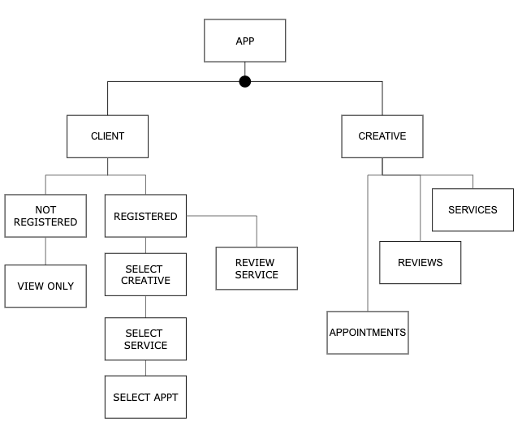
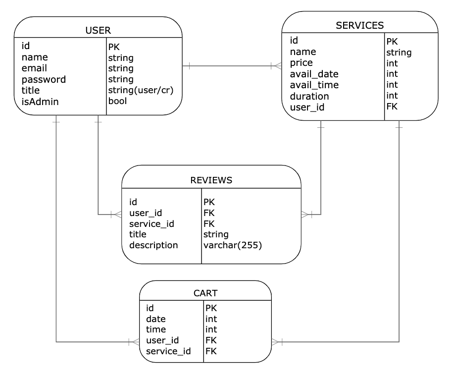

# BookIt

MERN fullstack e-commerce application

## January 4, 2021

### Michael Jennings

[Website](https://miggymike.github.io/) | [LinkedIn](https://www.linkedin.com/in/mjennings6/) | [Book It](.html)

---

### Overview

A services app, where users and potential clients can preview, and book appointments. Where Creatives can post services, availability, and manage appointments.

As a client one can do the following:

- Register account
- Find a Creative
- Select a service (registered)
- Review a service/creative (registered)
- book, cancel and reschedule an appoinment (registered)
- view services & reviews only (non-registered)

As a Creative one can do the following:

- profile with info
- manage availability
- manage services
- manage reviews
- manage admin

---

### Technologies Used

- MongoDB
- Express
- React/Redux
- Node
- HMTL/CSS/JavaScript
- Mongoose
- Acuity(schedueling app)

---

### Demo/

---

---

### Future updates / Stretch Goals / Planned Improvements / Post MVP

- [ ] Integrate image/file uploading
- [ ] Integrate sockets
- [ ] Integrate a UI Library (Bootstrap, Materialize, Material-UI, React-MD)

---

### Component Hierarchy Diagram (Enity Relationship Diagram)

### ERD (Enity Relationship Diagram)

---

### Credits

- imgs from [unsplash](https://miggymike.github.io/) and google
- Google Fonts
